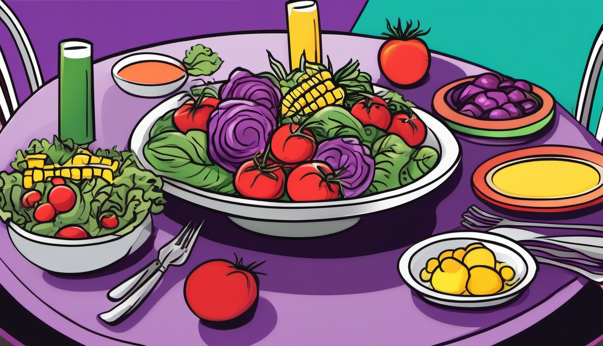
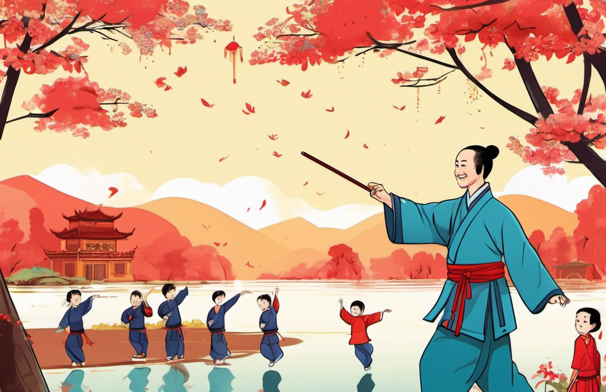
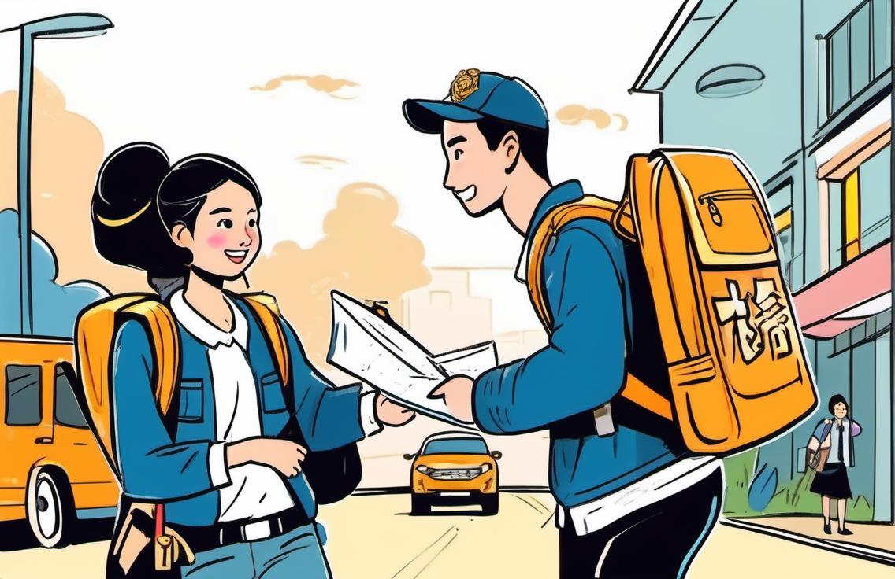
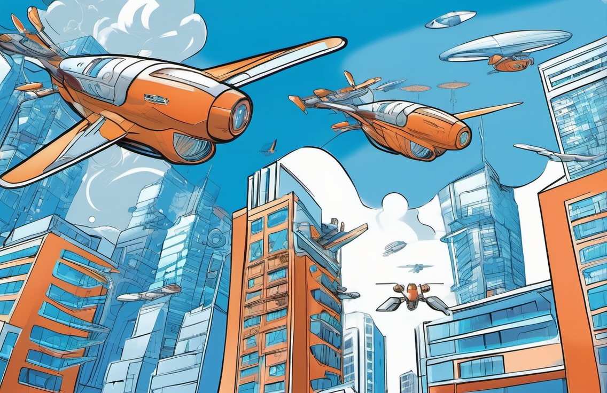

# NewsPicGen

NewsPicGen: News Picture Prompt Generation Model是一个中文新闻配图生成模型，使用[Qwen2.5-1.5B-Instruct](https://huggingface.co/Qwen/Qwen2.5-1.5B-Instruct)作为基座模型，使用SFT进行微调。
可以生成与新闻内容相关的高质量的中英双文配图prompt、中英双文关键字和绘画类型。直接通过Stable Diffusion生成配图，可根据绘画类型配置不同的绘图模板，生成多种风格的配图。

<table>
    <tr>
        <td>
            
        </td>
        <td>
            
        </td>
        <td>
            
        </td>
        <td>
            
        </td>
    </tr>
</table>

<p align="center">
        🤗 <a href="https://huggingface.co/blacker521/NewsPicGen/">Hugging Face</a>&nbsp&nbsp | &nbsp&nbsp🤖 <a href="https://modelscope.cn/models/blacker521/NewsPicGen">ModelScope</a>&nbsp&nbsp | &nbsp&nbsp💻 <a href="https://github.com/blacker521/NewsPicGen">Github</a>
</p>

## 样例

以下样例使用NewsPicGen生成绘画指令，使用配置模板和Stable Diffusion生成配图。
<!--  -->
<table>
    <tr>
        <th>新闻</th>
        <th style="width: 150px;">英文绘画指令</th>
        <th>中文关键词</th>
        <th>图片</th>
    </tr>
    <tr>
        <td><a href="https://baijiahao.baidu.com/s?id=1810945829190023515">心脑血管疾病患者宜吃的“彩色”美食</a></td>
        <td>Draw a colorful dining table with various "colored" foods such as tomatoes, carrots, corn, spinach, and purple cabbage.</td>
        <td>心脑血管疾病，色彩守护</td>
        <td></td>
    </tr>
    <tr>
        <td><a href="https://baijiahao.baidu.com/s?id=1810963351722892019">3762人展示太极扇挑战成功！基尼斯世界纪录在广州黄埔龙湖诞生</a></td>
        <td>The center of the picture is an elderly man in a Tai Chi suit, he is waving the red Tai Chi fan with perfect movements and full vitality...</td>
        <td>太极扇，传承千年文化</td>
        <td></td>
    </tr>
    <tr>
        <td><a href="https://content-static.cctvnews.cctv.com/snow-book/index.html?item_id=3094286144295671472&source=50001&sub_source=50001_006">点赞！青岛两名大学生捡到一斤多黄金交还失主!</a></td>
        <td>Draw a scene of two college students carrying backpacks, smiling, finding a black business handbag on the roadside with some golden items inside, and police officers questioning around."</td>
        <td>大学生拾金不昧</td>
        <td></td>
    </tr>
    <tr>
        <td><a href="https://baijiahao.baidu.com/s?id=1810886409729822758">驶向“未来之城”</a></td>
        <td>Draw a city background with high-tech elements in the middle, surrounded by various types of flying machines. The color scheme is mainly blue and white to symbolize technology and futurism.</td>
        <td>驶向未来，智行天下！</td>
        <td></td>
    </tr>
</table>

## 功能 
- 生成与新闻内容相关的高质量的中英双文配图prompt、中英文关键字和绘画类型。
- 微调数据使用万级新闻数据，并采用多任务进行SFT微调，在生成绘画prompt的同时，对绘画类型（1.动物、2.人、3.人群、4.风景、5.建筑、6.科技产品、7.物品、8.其他）进行判断，强化模型输出效果。可以针对不同的绘画类型，配置不同的绘画模板。
- 支持JSON格式化输出，方便后续使用。
- 生成图片为漫画风格，对于新闻配图有较好的表现。
## 性能

- 使用QWen2.5-1.5B-Instruct作为基座模型，中等长度新闻生成绘画指令平均耗时500ms（A100-80G），配合[SGLang](https://github.com/modelscope/sglang)/[vllm](https://github.com/vllm-project/vllm)等框架可以更快的生成绘画指令。
- 可以在消费级显卡上运行。

## 快速开始

### 🤗 Hugging Face Transformers

使用Transformers生成绘画指令

```python
import json
from transformers import AutoModelForCausalLM, AutoTokenizer

model_name = "blacker521/NewsPicGen"

model = AutoModelForCausalLM.from_pretrained(
    model_name,
    torch_dtype="auto",
    device_map="auto"
)
tokenizer = AutoTokenizer.from_pretrained(model_name)


title = "孙颖莎谈大满贯最大的挑战"
content = "#孙颖莎希望找到赛场上拼搏的状态# 9月24日，是WTT中国大满贯2024倒计时2天，球员@孙颖莎 接受专访。孙颖莎在采访中谈及大满贯中最大的挑战，她表示大满贯已经是很顶尖的赛事水平了，所以每场球都会有挑战，希望自己能找到积极专注的在赛场上拼搏的状态。"
prompt = f'以下是一篇新闻，标题“{title}”。新闻内容：{content}，请根据新闻内容生成绘画指令，图片要符合新闻内容，并且有创意。'
messages = [
    {"role": "user", "content": prompt}
]
text = tokenizer.apply_chat_template(
    messages,
    tokenize=False,
    add_generation_prompt=True
)
model_inputs = tokenizer([text], return_tensors="pt").to(model.device)

generated_ids = model.generate(
    **model_inputs,
    max_new_tokens=512
)
generated_ids = [
    output_ids[len(input_ids):] for input_ids, output_ids in zip(model_inputs.input_ids, generated_ids)
]

response = tokenizer.batch_decode(generated_ids, skip_special_tokens=True)[0]
print(json.dumps(response, ensure_ascii=False))
# {
#    "ch_keyword": "挑战大满贯，全力以赴",
#    "ch_prompt": "画一个正在比赛中奋力拼搏的女子乒乓球运动员，她的面庞充满斗志和决心，手中握着乒乓球拍，眼睛紧盯着对手，背景为观众席上的欢呼声。",
#    "en_keyword": "Challenging Grand Slam",
#    "en_prompt": "Draw a female table tennis player in the middle of an intense match, her face filled with determination and resolve, holding a ping pong paddle in her hand, staring at her opponent closely, and the cheering from the audience in the background.",
#    "type": "2"
# }
```